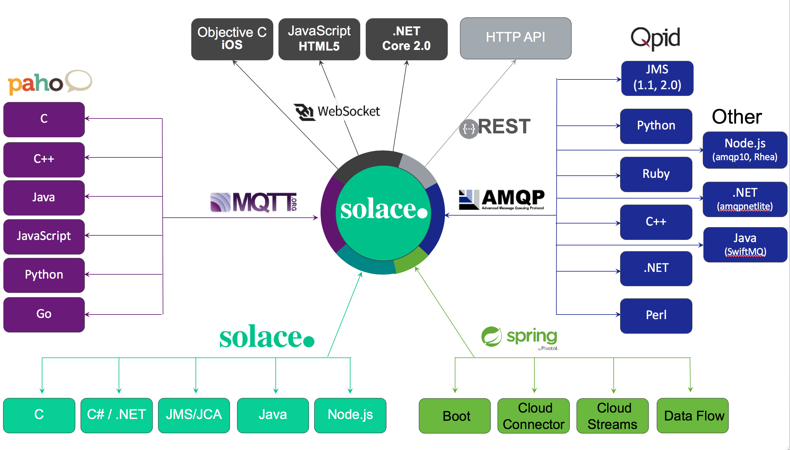
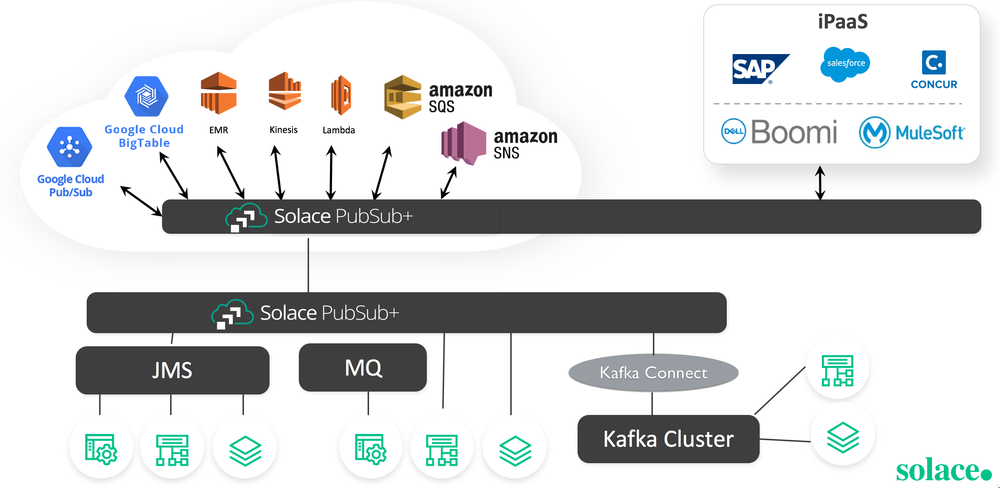
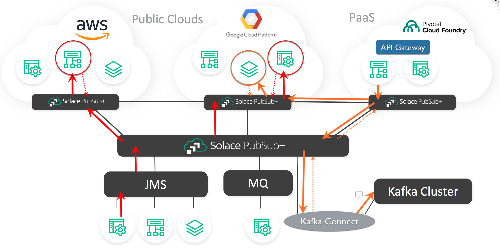
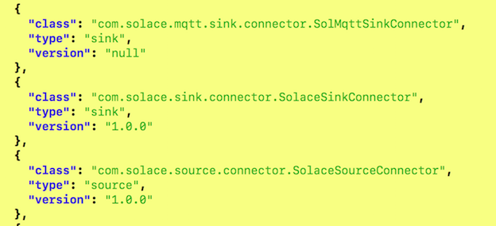

# Solace Source Kafka Connector v1.0

## Synopsis

This project provides a Solace/Kafka Source Connector (adapter) that makes use of the Kafka Connect libraries.
The Solace/Kafka adapter consumes Solace real-time queue or topic data events and streams the Solace events to a Kafka topic. 

The Solace Source Connector was created using Solace's high performance Java API to move Solace data events to the Kafka Broker. 
Unlike many other message brokers, Solace supports transparent protocol and API messaging transformations, therefore, 
any message that reaches the Solace broker, regardless of the many Solace supported message transports or language/API, can be moved to a Topic 
(Key or not Keyed) on the Kafka Broker via the single Solace Source Connector. 

Consider the following diagram:



It does not matter if the ingress message to the Solace broker (appliance, software or cloud) is from an iPhone, a REST POST or an AMQP, JMS or MQTT message, it can be sent automatically to the Kafka Topic via the Solace Source Connector.

The Solace Source Connector also ties Kafka records into the Solace Event Mesh. 
The Event Mesh is a clustered group of Solace PubSub+ Brokers that transparently, in real-time, route data events to any Service that is part of the Event Mesh. 
Solace PubSub+ Brokers (Appliances, Software and SolaceCloud) are connected to each other as a multi-connected mesh that to individual services 
(consumers or producers of data events) appears to be a single Event Broker. Events messages are seamlessly transported within the entire Solace Event 
Mesh regardless of where the event is created and where the process exists that has registered interested in consuming the event. 
Simply by having the Solace Source Connector register interest in receiving events, the entire Event Mesh becomes aware of the registration request and will know how to securely 
route the appropriate events generated by other service on the Event Mesh to the Solace Source Connector. The Solace Source Connector takes those event
 messages and sends them as Kafka Source Records to the Kafka broker for storage in a Kafka Topic.

The Solace Source Connector allows any event from any service in the Solace Event Mesh to generate a new record in Kafka. 
It does not matter which service in the Event Mesh created the event, they are all potentially available for storage in Kafka via
 a single Solace Source Connctor.There is no longer a requirement for separate Kakfa Source Connectors to each of the separate services. 
The single Solace Source Connector is all that is required. Any event that the connector registers interest in receiving from the Event Mesh is stored in Kafkfa. 

The Solace Source Connector eliminates the complexity and overhead of maintaining separate Source Connectors for each and every service that generates data events that Kakfa may wish to consume. 
There is the added benefit of access to services where there is no Kafka Source Connector available, thereby eliminating the need to create and maintain a new connector for 
services from which Kafka may wish to store the data.

Consider the following:



A single Solace Source Connector will be able to move service events from any upstream service to Kafka via a single connector. 

The Solace Source Connector also ties into Solace's location transparency for the Event Mesh PubSub+ brokers. 
Solace supports a wide range of brokers for deployment. 
There are three major categories of Solace PubSub+ brokers: dedicated extreme performance hardware appliances, 
high performance software brokers that are deployed as software images (deployable under most Hypervisors, Cloud IaaS and PaaS layers and in Docker) 
and provided as a fully managed Cloud MaaS (Messaging as a Service). 

It does not matter what Solace Broker is used or where it is deployed, it can become part of the Solace Event Mesh. 
Therefore, there are no restrictions on where the Solace Source Connector is deployed or what PubSub+ broker is used to connect Kafka to the Solace Event Bus. 
The Solace Event Mesh infrastructure will allow, via the Solace Source Connector, any events in the Event Mesh to be transported and stored in Kafka. 

Consider the following:



It does not matter where in the Service Mesh the Service is located that generated the event.
It does not matter if Solace Source Connector was connected to a Solace PubSub+ broker that was an appliance, 
on premise or Cloud software, or the the Cloud managed MaaS, it will immediately, in real time, be available to pass that data for Storage in Kafka. 

It is important to mention that there is also a Solace Sink Connector for Kafka available. The Solace Sink Connector allows consumption of new Kafka Records added to the Kafka brokers to 
 any service that has registered
 interest in consuming any new Kafka Record events from the Service Mesh. Please refer to the Solace Sink Connector GitHub repository for more details. 

## Usage

This is a Gradle project that references all the required dependencies. To check the code style and find bugs you can use:

```ini
./gradlew clean check
```

To actually create the  Connector Jar file use:

```ini
./gradlew clean jar
```

## Deployment

The Solace Source Connector has been tested in three environments: Apache Kafka, Confluent Kafka and the AWS Confluent Platform. 
For testing, it is recommended to use the single node deployment of Apache or Confluent Kafka software.

To deploy the Connector, as described in the Kafka documentation, it is necessary to move the Connector jar file and the required third party jar files to a directory that is part of the Worker-defined classpath. Details for installing the Solace Source Connector are described in the next two sub sections. 

#### Apache Kafka

For Apache Kafka, the software is typically found, for example for the 2.11 version, under the root directory: "/opt/kafka-apache/"kafka_2.11-1.1.0". Typically the Solace Source Connector would be placed under the "libs" directory under the root directory. All required Solace JCSMP JAR files should be placed under the same "libs" directory. The properties file for the connector would typically be placed under the "config" directory below the root directory. 

To start the connector in stand-alone mode while in the "bin" directory the command would be similar to:

```ini
./connect-standalone.sh ../config/connect-standalone.properties ../config/solaceSource.properties
```

In this case "solaceSource.properties" is the configuration file that you created to define the connectors behavior. 
Please refer to the sample included in this project. 

When the connector starts in stand-alone mode, all output goes to the console. If there are errors they should be visible on the console. 
If you do not want the output to console, simply add the "-daemon" option and all output will be directed to the logs directory.

#### Confluent Kafka

The Confluent Kakfa software is typically placed under the root directory: "/opt/confluent/confluent-4.1.1". In this case it is for the 4.1.1 version of Confluent. 
By default, the Confluent software is started in distributed mode with the REST Gateway started. 

The Solace Source Connector would typically be placed in the "/opt/confluent/confluent-4.1.1/share/java/kafka-connect-solace" directory. 
You will need to create the "kafka-connect-solace" directory. 
You must place all the required Solace JCSMP JAR files under this same directory. 
If you plan to run the Source Connector in stand-alone mode, it is suggested to place the properties file under the same directory.

After the Solace files are installed and if you are familiar with Kakfa administration, it is recommended to restart the Confluent Connect software if Confluent is running in Distributed mode. Alternatively, it is simpler to just start and restart the Confluent software with the "confluent" command.

At this point you can test to confirm the Solace Source Connector is available for use  in distributed mode with the command:
```ini
curl http://18.218.82.209:8083/connector-plugins | jq
```

In this case the IP address is one of the nodes running the Distributed mode Worker process. If the Connector is loaded correctly, you should see something similar to:



At this point, it is now possible to start the connector in distributed mode with a command similar to:

```ini
curl -X POST -H "Content-Type: application/json" -d @solace_source_properties.json http://18.218.82.209:8083/connectors
``` 

Again, the IP address is one of the nodes running the Distributed mode Worker process. The connector's JSON configuration file, in this case, 
is called "solace_source_properties.json".

You can determine if the Source Connector is running with the following command:

```ini
curl 18.218.82.209:8083/connectors/solaceSourceConnector/status | jq
```

If there was an error in starting, the details will be returned with this command. 

## Configuration

The Solace Source Connector configuration is managed by the configuration file. For stand-alone Kafka deployments a properties file is used. A sample is enclosed with the project.

For distributed Kafka deployments the connector can be deployed via REST as a JSON configuration file. A sample is enclosed with the project. 

The Solace configuration of the connector's Solace Session, Transport and Security properties are all available and defined in the **SolaceSourceConstants.java** file. These are the 
equivalent to the details for the Solace **JCSMPSessionProperties** class. Details and documentation for this JCSMPProperies class can be found here:

[Solace Java API](https://docs.solace.com/API-Developer-Online-Ref-Documentation/java/index.html)

For tuning, performance and scaling (multiple tasks is supported with this connector) of the Solace Source Connector, please refer to the Solace PubSub+ documentation that can be found here:

[Solace PubSub+ Documentation](https://docs.solace.com/)

There is a bare minimum requirement to configure access to the Solace PubSub+ broker.
 A username, their password and VPN (Solace Virtual Private Network - a "virtual broker" used in Solace multi-tenancy configurations) and host 
 reference are mandatory configuration details. An example of the required configuration file entries is as follows:

```ini
sol.username=heinz1
sol.password=heinz1
sol.vpn_name=heinzvpn
sol.host=160.101.136.33
```

If you have just installed a Solace PubSub+ broker and you are not that familiar with Solace administration, 
you can test your Source Connector by using "default" as value for the username, password and VPN name. 
The host should match the IP address of the broker.

For connectivity to Kafka, the Source Connector has four basic configuration requirements: name for the Connector Plugin, the name of the Java Class
for the connector, the number of Tasks the connector should deploy and the name of the Kakfa Topic. The following is an example for the Solace Source Connector:

```ini
name=solaceConnector
connector.class=com.solace.source.connector.SolaceSourceConnector
tasks.max=2
kafka.topic=solacetest
```

A more details example is included with this project. This project also includes a JSON configuration file.

#### Solace Message Processor

The processing of the Solace message to create a Kafka Source Record is handled by an interface definition defined in `SolaceMessageProcessor.java`. This is a simple interface that is used to create the Kafka Source Records from the Solace messages. There are two examples included of classes that implement this interface:

* **SolSimpleMessageProcessor.java** - which takes the Solace message as a binary payload and creates a Kafka Source record with a Binary Schema for the value (Solace message payload) and a Binary Schema for the record key.
* **SolaceSampleKeyedMessageProcessor** - A more complex sample that allows the flexibility of changing the Source Record Key Schema and which value from the Solace message to use as a key. The option of no key in the record is also possible.

The desired message processor is loaded at runtime based on the configuration of the JSON or properties configuration file, for example:

`sol.message_processor_class=com.solace.source.connector.msgProcessors.SolSampleSimpleMessageProcessor`

It is possible to create more custom Message Processors based on you Kafka record requirements for keying and/or value serialization and the desired format of the Solace event message. Simply add the new message processor classes to the project. The desired message processor is installed at run time based on the configuration file. 

More information on Kakfa Connect can be found here:

[Apache Kafka Connect](https://kafka.apache.org/documentation/)

[Confluent Kafka Connect](https://docs.confluent.io/current/connect/index.html)


#### Scaling the Source Connector

The Solace Source Connector will scale when more performance is required. There is only so much throughput that can be pushed through the 
Connect API. The Solace broker supports far greater throughput than can be afforted through a single instance of the Connect API. 
The Kafka Broker can also produce records at a rate far greater than available through a single instance of the Connector. 
Therefore, multiple instances of the Source Connector will increase throughput from the Kafka broker to the Solace PubSub+ broker.

Multiple Connector tasks are automatically deployed and spread across all available Connect Workers simply by indicating the number of desired 
tasks in the connector configuration file. 

When the Source Connector is consuming from Kafka and the event records are expected to be placed in to a Solace Queue, 
there are no special requirements for the Queue definition. As more instance of the connector are defined in the configuration, 
the Solace broker will automatically load balance the consumption of messages from the Solace Queue to the multiple Source Connectors.

If the Source Connector is interested in consuming messages there are two options for scaling the connector with respect to the consumption of events 
form Solace: 
Topic-to-Queue Bridging and Solace Deliver-to-One processing.

The Topic-to-Queue bridging is the simple process of configuring a Solace Queue to attract Solace Topic data event. 
These data events will immediately be available via the Solace Queue and the setup for scaling is as described above for queues.

Solace also supports Deliver-to-One processing for Solace Topic messages. By the nature of Topics, if there are multiple consumers on a Topic, 
all consumers will receive all of the same topic data event messages. Solace provides scaling of Topic data using Deliver-to-One (DTO).
Kafka provides scaling similar to DTO for consuming Kafka Topic data using 
Consumer Groups. 


For the Source Connector to receive DTO messages, DTO override must be disabled for the connector. This is accomplished by adding the following line to the properties or JSON configuration file:

```ini
sol.subscriber_dto_override=false
```

This means that the Source Connector will provide load balancing of Solace Topic messages. 
There is no practical scaling limitation with DTO; you can create as many DTO consumers as you like. More instances of the Source Connector 
will automatically be load balanced for consumption from the Solace Topic(s).

For DTO processing, it is important to note that the message producer must also send messages that are tagged for DTO processing. 
If the Source Connector is consuming on a topic that the producer did not send DTO-tagged messages, the connector will simple act as if 
DTO override is enabled and write duplicate messages into the Kafka Topic. 

If the Solace producers are sending on some Solace Topics with DTO tagged messages and some other Solace topics without DTO, 
then it will require two deployments of the connector if scaling is required. 
One connector will include the topics where DTO is used by the message producers. 
A second connector will use a queue and the non-DTO producer topics will be bridged to the referenced queue. 
 
For more detail on DTO and Topic-to-Queue bridging is available in the Solace documentation.

It is also important to note that the Solace Sink Connector can be configured to send DTO flagged messages. Therefore, when new record are placed into
Kakfa, the Solace Sink Connector can be used to generate DTO tagged messages.  

#### Sending Solace Events to Kafka

The Solace Source Connector consumes registered Solace Data Even Messages and writes them to Kafka as Source Records. The connector can register 
interest in receiving Solace Queue or Topic message events. 

When using Topics, Solace uses "best effort" to deliver the events to the Sink Connector. If the Connector is down, or messages are constantly generated
 at a rate fast than can be written to Kafka, there will be potential for data loss. If Kafka is configured for it's highest throughput, it also 
 is susceptible for loss and obviously, cannot add records if the Kafka broker is unavailable. Therefore, when the Kafka Topic is configured for high throuput
 the use of Solace Topics to receive the data event messages is acceptable and recommended.
 
 As mentioned above, the Connect API may become the limiting factor for processing of the events. 
 To prevent potential data loss thorough the Connector when using topics, it may be necessary to scale the number of connector task instances.
 
It is also possible to have the Solace Source Connector register interest in the Service Mesh to attract data events from Solace Queues 
. A Solace Queue guarantees order of deliver, provides High Availability and Disaster Recovery (depending on the setup of the PubSub+ brokers)
 and provides an acknowledgment to the message producer (in this case the Solace event producer application) when the event is stored in all 
 HA and DR members and flushed to disk. This is a higher guarantee than is provided by Kakfa even for Kafka idempotent delivery.
 
When A Kafka Topic is configured with it's highest quality-of-service, with respect to record loss or duplication, it results in a large reduction in record processing throughput. 
However, in some application requirements this QoS is required. In this case, the Solace Source Connector should use Solace Queues for the consumption
of events from the Event Mesh.

The Solace Source Connector consumes messages from the queue and streams the records to the Kafka Topic. A timed process (which is configurable in the
 in the Worker's configuration file), flushes the records and offset to to disk. The Solace connector will consume the messages from the queue
 and when 500 messages are consumed or the current connector "poll()" method completes, it will force the Kafka commit to flush records and the offset and only then will the processed Solace Queue data event messages
  be acknowledged and removed from the Solace Queue. If the Connector or Kafka fail before the timed or forced commit, the Solace messages are
  not lost, they will be retransmitted as soon as the connector or Kafka are restarted. It is important to note that while connector or the
  Kafka Broker are offline, the Solace Queue will continue to add event messages, so there will be no loss of new data from the Solace Event Mesh.
  
When the Kafka consumers require the highest level of QoS, it is recommended to use the Solace Source Connector against Solace Queues. If the throughput
through the Connect is not high enough, and messages are starting to accumulate in the Solace Queue, scaling of the Connector is recommended
as discussed above. If the Source Connctor has not been scaled to a required level to deal with bursts  the Solace Queue can act as a "shock absorber"
to deal with micro bursts or sustained periods of heavy event generation in the Event Mesh. Data events will no be lost of the connector is under-scaled due to 
an unforeseen burst event.


## License

This project is licensed under the Apache License, Version 2.0. - See the [LICENSE](https://github.com/SolaceLabs/solace-messaging-demo/blob/master/LICENSE) file for details.