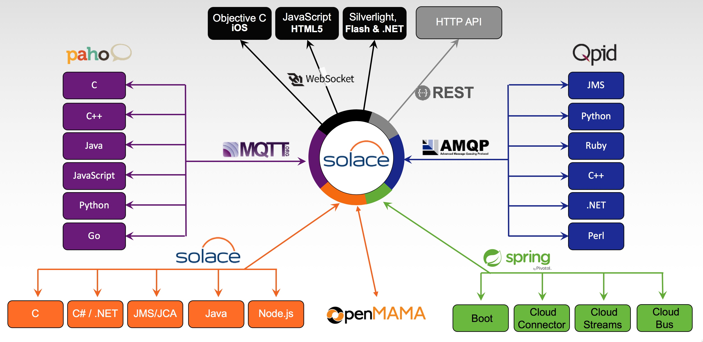

# Solace Source Kafka Connector v1.0

## Synopsis

This project provides a Solace Source adapter that makes use of the Kafka Connect libraries. The Solace/Kafka adapter consumes Solace queue or topic messages and writes the message data to a Kafka topic. 

The Source Source Connector was created using Solace's high performance Java API to move Solace messages to the Kafka Broker. Unlike many other message brokers, Solace supports transparent protocol and API messaging transformations, therefore, any message that reaches the Solace broker, regardless of the many Solace supported message transports or language/API, can be moved to a Topic (Key or not Keyed) on the Kafka Broker. 

Consider the following diagram:

It does not matter if the ingress message to the Solace broker (appliance, software or cloud) is from an iPhone, a REST POST or an AMQP, JMS or MQTT message, it can be sent automatically to the Kafka Topic via the Solace Source Connector.

## Usage

This is a Gradle project that references all the required dependencies. To check the code style and find bugs you can use:

`./gradlew clean check`

To actually create the  Connector Jar file use:

`./gradlew clean jar`

## Deployment

To deploy the Connector, as described in the Kafka documentation, it is necessary to move the Connector jar file and the required third party jar files to a directory that is part of the Worker-defined Classpath.

## Configuration

The Solace Source Connector configuration is managed by the configuration file. For stand-alone Kafka deployments a properties file is used. A sample is enclosed with the project.

For distributed Kafka deployments the connector can be deployed via REST as a JSON configuration file. A sample is enclosed with the project. 

The Solace configuration of the connector's Solace Session, Transport and Security properties are all available and defined in the `SolaceSourceConstants.java` file. These are the equivalent to the details for the Solace `JCSMPSessionProperties` class. Details and documentation for this JCSMPProperies class can be found here:

[Solace Java API](https://docs.solace.com/API-Developer-Online-Ref-Documentation/java/index.html)

For tuning, performance and scaling (multiple tasks is supported with this connector) of the Solace Source Connector, please refer to the Solace PubSub+ documentation that can be found here:

[Solace PubSub+ Documentation](https://docs.solace.com/)

The processing of the Solace message to create a Kafka Source Record is handed by an interface definition defined in `SolaceMessageProcessor.java`. This is a simple interface that is used to create the Kafka Source Records from the Solace messages. There are two examples included:

`SolSimpleMessageProcessor.java` - which takes the Solace message as a binary payload and creates a Kafka Source record with a Binary Schema for the value (Solace message payload) and a Binary Schema for the record key.
`SolaceSampleKeyedMessageProcessor` - A more complex sample that allows the flexibility of changing the Source Record Key Schema and which value from the Solace message to use as a key. The option of no key in the record is also possible.

The desired message processor is loaded at runtime based on the configuration of the JSON or properties configuration file, for example:

`sol.message_processor_class=com.solace.source.connector.msgProcessors.SolSampleSimpleMessageProcessor`

## License

This project is licensed under the Apache License, Version 2.0. - See the [LICENSE](https://github.com/SolaceLabs/solace-messaging-demo/blob/master/LICENSE) file for details.